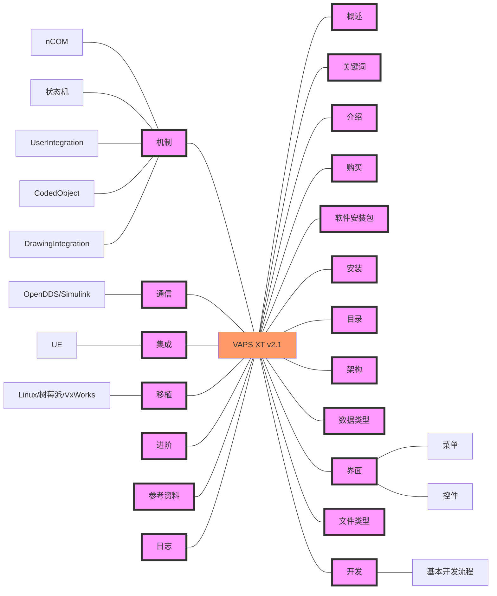
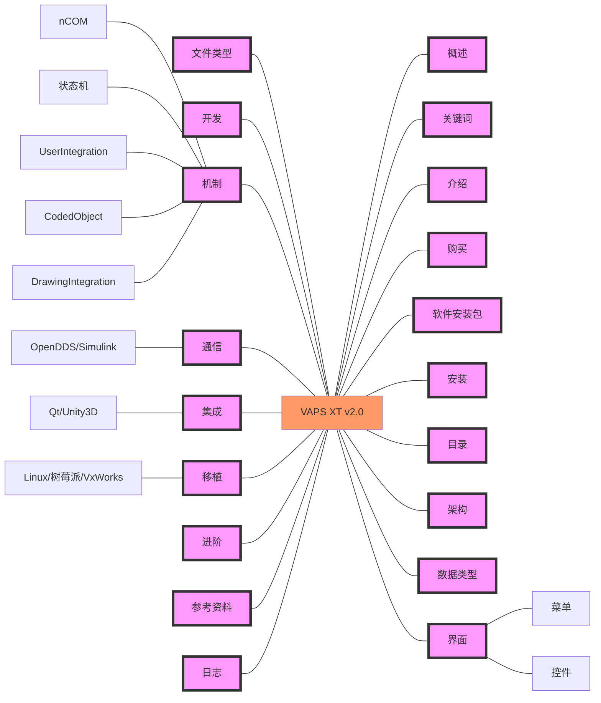
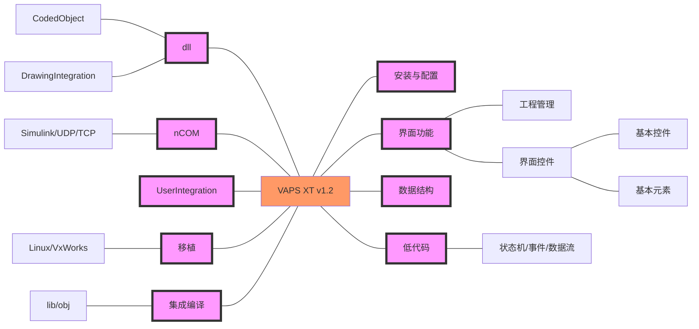
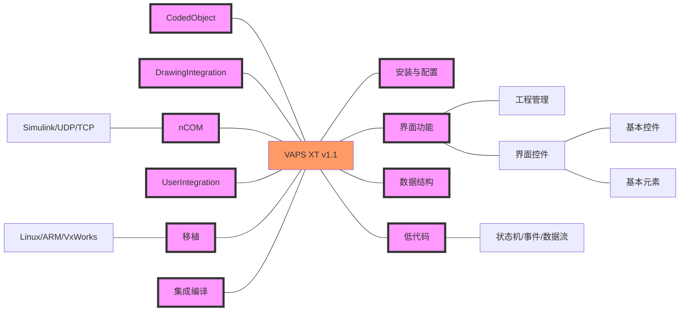
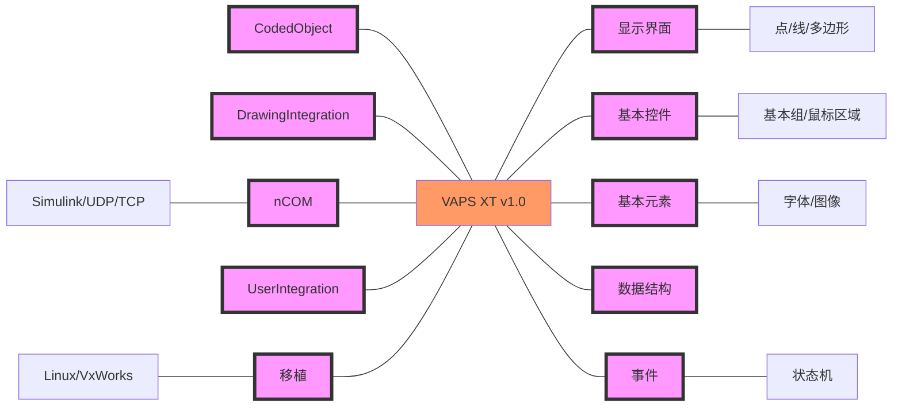

# VAPS_XT

<a href="https://blog.jackeylea.com/vapsxt/vapsxt-learning-indexes" target="_blank">VAPS XT开发入门教程</a>附属完整项目工程

**因为可能涉及公司业务，VAPS XT工程已删除**

2023年第三季度，Presagis将嵌入式图形(Embedded Graphics,EG)业务出售给了意大利TXT集团，VAPS XT产品线将不在属于Presagis。

## 注意

学习VAPS XT你需要：
- 软件，软件里面有官方的参考文档，虽然是英文的，但那是最容易获取到的资料
- 官方示例，这个是我们能够接触到的最全面的实际能够使用的工程
- 前人工程，如果有前人做过的实际工程，如果有做过项目的大佬指导就更好了。同时成熟的公司一般都会有内部的培训文档
- 论文，论文仅仅提供了思路没有实际操作步骤，但是这个思路很重要，如果方向错了，你技术再多也没有用
- 英语，购买软件后官方免费提供1年技术支持，一般是发英文邮件，超出后按小时收取费用
- VAPS XT生成的代码很稳定，但是用来设计的工具不稳定，设计开发时要随时保存，否则设计工具崩溃退出就得重新来过
- VAPS XT设计工具编译的时候会调用对应的VS工具进行编译；VAPS XT版本对应的VS版本在VAPS XT安装包名称上有提示，比如VAPS XT4.1对应VC10即VS2010，VAPS XT4.2.1对应VC12即VS2013，具体版本没有限制Express、ultimate都可以；不同版本的VS功能可能会不同，实测vs2010express无法编译生成64位dll而ultimate可以
- 删除设计的控件时，会把控件所有的代码、数据流都删除，如果数据流、代码所在的位置包含其他的代码也会一起删除
- 本系列涉及的所有内容都是我用过的，如果你搜索的话会发现VAPS XT资料教程很少，除了我发布的就是论文了
- 根据我的经验，VAPS XT就是各种官方提供的控件的套娃组合，只是大佬知道如何方便快速高效使用，这个得在实际项目中锻炼出来
- 各个部分是相互关联的，比如介绍状态机的运行原理就需要控件和代码来演示，无法做到清晰的切割，所以只能用到啥写啥，多看几遍
- VAPS XT是收购的其他公司的产品，前身是VAPS
- 当前为公开版，因为保密、版权等原因，此版本是内部版删除一些操作、细节后的内容。
- 一般是国企（比如说我旁边的某研究所）或者学校使用，毕竟价格在这。如果你不是国企你们不要接触这些，毕竟出来的工作不好找。当然，现在软件国产化是趋势，以后国内军工/国企势必会替换这些工具。
- 这个软件的圈子很小，比ANSYS SCADE还要小，所以资料难找
- 测试环境Windows 10 + VAPS XT 4.2.1 + VS 2017 15.9 + VxWorks 6.9.10 以及 Ubuntu 22.04.1 LTS + GCC 11.1 + make  5.0
- 官方技术人员位于意大利，与中国时差为7小时，即他们的8点是我们的下午3点
- 外国真有劳动法，下班时间、周末、休假时间不会提供技术支持

## 索引

- <a href="https://blog.jackeylea.com/vapsxt/introduction-of-vapsxt/" target="_blank">VAPSXT入门教程01：软件介绍</a>
- <a href="https://blog.jackeylea.com/vapsxt/how-to-buy-vapsxt/" target="_blank">VAPSXT入门教程02：购买</a>
- <a href="https://blog.jackeylea.com/vapsxt/collections-of-vapsxt-exe/" target="_blank">VAPSXT入门教程03：软件安装包</a>
- <a href="https://blog.jackeylea.com/vapsxt/vapsxt-installation/" target="_blank">VAPSXT入门教程04：安装流程</a>
- <a href="https://blog.jackeylea.com/vapsxt/introduction-of-vapsxt-program-dir/" target="_blank">VAPSXT入门教程05：软件目录</a>
- <a href="https://blog.jackeylea.com/vapsxt/architecture-of-vapsxt/" target="_blank">VAPSXT入门教程06：架构</a>
- <a href="https://blog.jackeylea.com/vapsxt/introduction-of-vapsxt-standard-data-type/" target="_blank">VAPSXT入门教程07：数据类型</a>
- <a href="https://blog.jackeylea.com/vapsxt/introduction-of-vapsxt-gui/" target="_blank">VAPSXT入门教程08：界面</a>
    - <a href="https://blog.jackeylea.com/vapsxt/vapsxt-editor-menu/" target="_blank">VAPS XT入门教程08.01：菜单</a>
    - <a href="https://blog.jackeylea.com/vapsxt/vapsxt-editor-toolbar/" target="_blank">VAPS XT入门教程08.02：工具栏</a>
- <a href="https://blog.jackeylea.com/vapsxt/introduction-of-vapsxt-file-format/" target="_blank">VAPSXT入门教程09：文件类型</a>
- <a href="https://blog.jackeylea.com/vapsxt/design-of-vapsxt/" target="_blank">VAPSXT入门教程10：开发</a>
    - <a href="https://blog.jackeylea.com/vapsxt/vapsxt-root-project/" target="_blank">VAPS XT入门教程10.01：创建新根工程</a>
    - <a href="https://blog.jackeylea.com/vapsxt/vapsxt-simple-widget/" target="_blank">VAPS XT入门教程10.02：简单控件</a>
    - <a href="https://blog.jackeylea.com/vapsxt/vapsxt-object-comment/" target="_blank">VAPS XT入门教程10.03：控件注释</a>
    - <a href="https://blog.jackeylea.com/vapsxt/vapsxt-simple-exe/" target="_blank">VAPS XT入门教程10.04：简单程序</a>
    - <a href="https://blog.jackeylea.com/vapsxt/how-to-compile-vapsxt-source-code/" target="_blank">VAPS XT入门教程10.05：源码编译</a>
    - <a href="https://blog.jackeylea.com/vapsxt/introduction-of-vapsxt-properties/" target="_blank">VAPS XT入门教程10.06：属性调用</a>
    - <a href="https://blog.jackeylea.com/vapsxt/introduction-of-vapsxt-event/" target="_blank">VAPS XT入门教程10.07：事件调用</a>
    - <a href="https://blog.jackeylea.com/vapsxt/introduction-of-vapsxt-function/" target="_blank">VAPS XT入门教程10.08：函数调用</a>
    - <a href="https://blog.jackeylea.com/vapsxt/vapsxt-pfd/" target="_blank">VAPS XT入门教程10.09：PFD</a>
    - <a href="https://blog.jackeylea.com/vapsxt/vapsxt-hudpfd/" target="_blank">VAPS XT入门教程10.10：HUDPFD</a>
    - <a href="https://blog.jackeylea.com/vapsxt/vapsxt-rolling-digits/" target="_blank">VAPS XT入门教程10.11：滚动数字</a>
    - <a href="https://blog.jackeylea.com/vapsxt/vapsxt-format-string/" target="_blank">VAPS XT入门教程10.12：格式化字符串</a>
    - <a href="https://blog.jackeylea.com/vapsxt/vapsxt-custom-button/" target="_blank">VAPS XT入门教程10.13：个性化按钮</a>
    - <a href="https://blog.jackeylea.com/vapsxt/vapsxt-multi-mouse-frame/" target="_blank">VAPS XT入门教程10.14：多界面鼠标操作框架</a>
    - <a href="https://blog.jackeylea.com/vapsxt/vapsxt-multi-touch-frame/" target="_blank">VAPS XT入门教程10.15：多界面触屏操作框架</a>
- <a href="https://blog.jackeylea.com/vapsxt/mechanism-of-vapsxt/" target="_blank">VAPSXT入门教程11：机制</a>
    - <a href="https://blog.jackeylea.com/vapsxt/introduction-of-vapst-ncom/" target="_blank">VAPS XT入门教程11.01：nCOM机制</a>
    - <a href="https://blog.jackeylea.com/vapsxt/state-machine-mechanism-of-vapsxt/" target="_blank">VAPS XT入门教程11.02：状态机</a>
        - <a href="https://blog.jackeylea.com/vapsxt/vapsxt-double-click-and-drag-drop-movement/" target="_blank">VAPS XT入门教程11.02.01：状态机与界面操作</a>
    - <a href="https://blog.jackeylea.com/vapsxt/introduction-of-vapst-userintegration/" target="_blank">VAPS XT入门教程11.03：UserIntegration机制</a>
    - <a href="https://blog.jackeylea.com/vapsxt/vapsxt-load-vapsxt-dll/" target="_blank">VAPS XT入门教程11.04：CodedObject机制</a>
        - <a href="https://blog.jackeylea.com/vapsxt/vapsxt-play-video-with-codedobject/" target="_blank">VAPS XT入门教程11.04.01：显示视频</a>
        - <a href="https://blog.jackeylea.com/vapsxt/vapsxt-display-3d-model-with-codedobject/" target="_blank">VAPS XT入门教程11.04.02：三维模型</a>
        - <a href="https://blog.jackeylea.com/vapsxt/custom-vapsxt-calculator/" target="_blank">VAPS XT入门教程11.04.03：自定义计算器</a>
    - <a href="https://blog.jackeylea.com/vapsxt/qt-load-vapsxt-compiled-dll-under-windows/" target="_blank">VAPS XT入门教程11.05：DrawingIntegration机制</a>
        - <a href="https://blog.jackeylea.com/vapsxt/qt-dynamic-load-vapsxt-so-under-linux/" target="_blank">VAPS XT入门教程11.05.01：Qt动态加载VAPS XT so</a>
        - <a href="https://blog.jackeylea.com/vapsxt/qt-dynamic-control-vapsxt-dll/" target="_blank">VAPS XT入门教程11.05.02：Qt动态控制VAPS XT多窗口DLL</a>
        - <a href="https://blog.jackeylea.com/vapsxt/sxearth-pro-load-vapsxt-dll/" target="_blank">VAPS XT入门教程11.05.03：SXEarth加载VAPS XT仪表</a>
        - <a href="https://blog.jackeylea.com/vegaprime/integration-of-vapsxt-drawing-integration/" target="_blank">VP入门教程03：调用VAPS XT DLL</a>
- <a href="https://blog.jackeylea.com/vapsxt/communication-of-vapsxt/" target="_blank">VAPSXT入门教程12：通信</a>
    - <a href="https://blog.jackeylea.com/vapsxt/vapsxt-communicate-with-opendds/" target="_blank">VAPS XT入门教程12.01：与OpenDDS通信</a>
    - <a href="https://blog.jackeylea.com/vapsxt/vapsxt-communicate-with-matlab-simulink-module/" target="_blank">VAPS XT入门教程12.02：与Simulink通信</a>
- <a href="https://blog.jackeylea.com/vapsxt/integration-of-vapsxt/" target="_blank">VAPSXT入门教程13：集成</a>
    - <a href="https://blog.jackeylea.com/ue/ue-sync-with-vapsxt-by-shared-memory/" target="_blank">UE4入门教程05：与VAPS XT交互</a>
- <a href="https://blog.jackeylea.com/vapsxt/transport-of-vapsxt/" target="_blank">VAPSXT入门教程14：移植</a>
    - <a href="https://blog.jackeylea.com/vapsxt/transplant-vapsxt-from-windows-to-linux/" target="_blank">VAPS XT入门教程14.01：PC Linux平台移植</a>
    - <a href="https://blog.jackeylea.com/vapsxt/transport-vapsxt-to-vxworks/" target="_blank">VAPS XT入门教程14.02：VxWorks平台移植</a>
    - <a href="https://blog.jackeylea.com/vapsxt/transport-vapsxt-app-to-vxworks653/" target="_blank">VAPS XT入门教程14.03：VxWorks653移植</a>
    - <a href="https://blog.jackeylea.com/vapsxt/transport-vapsxt-to-localized-platform/" target="_blank">VAPS XT入门教程14.04：国产平台移植</a>
- <a href="https://blog.jackeylea.com/vapsxt/a661-of-vapsxt/" target="_blank">VAPS XT入门教程15：A661开发</a>
    - <a href="https://blog.jackeylea.com/vapsxt/vapsxt-a661-mode/" target="_blank">VAPS XT入门教程15.01：A661模式</a>
    - <a href="https://blog.jackeylea.com/vapsxt/how-to-run-vapsxt-a661-example/" target="_blank">VAPS XT入门教程15.02：A661示例运行</a>
    - <a href="https://blog.jackeylea.com/vapsxt/intro-of-ua-emulator/" target="_blank">VAPS XT入门教程15.03：UA Emulator简介</a>
    - <a href="https://blog.jackeylea.com/vapsxt/intro-of-ua-accelerator/" target="_blank">VAPS XT入门教程15.04：UA²简介</a>
    - <a href="https://blog.jackeylea.com/vapsxt/how-to-install-user-application-accelerator/" target="_blank">VAPS XT入门教程15.05：UA²安装与配置</a>
    - <a href="https://blog.jackeylea.com/vapsxt/how-to-install-user-application-emulator/" target="_blank">VAPS XT入门教程15.06：UA Emulator安装与配置</a>
    - <a href="https://blog.jackeylea.com/vapsxt/how-to-use-user-application-emulator/" target="_blank">VAPS XT入门教程15.07：UA Emulator使用</a>
- <a href="https://blog.jackeylea.com/vapsxt/advance-of-vapsxt/" target="_blank">VAPSXT入门教程16：进阶</a>
    - <a href="https://blog.jackeylea.com/vapsxt/vapsxt-posterror-debug/" target="_blank">VAPS XT入门教程16.01：调试之字符串</a>
    - <a href="https://blog.jackeylea.com/vapsxt/fix-vapsxt-output-text-error/" target="_blank">VAPS XT入门教程16.02：调试之编译输出</a>
    - <a href="https://blog.jackeylea.com/vapsxt/vapsxt-trace-manager/" target="_blank">VAPS XT入门教程16.03：调试之trace manager</a>
    - <a href="https://blog.jackeylea.com/vapsxt/vapsxt-dynamic-load-images/" target="_blank">VAPS XT入门教程16.04：动态加载图片</a>
    - <a href="https://blog.jackeylea.com/vapsxt/vapsxt-load-font-files/" target="_blank">VAPS XT入门教程16.05：字体加载问题</a>
    - <a href="https://blog.jackeylea.com/vapsxt/vapsxt-raster-font/" target="_blank">VAPS XT入门教程16.06：raster字体</a>
    - <a href="https://blog.jackeylea.com/vapsxt/analysis-of-vaps-activation-method/" target="_blank">VAPS XT入门教程16.07：激活方式</a>
    - <a href="https://blog.jackeylea.com/vapsxt/crack-of-vaps-xt/" target="_blank">VAPS XT入门教程16.08：暴力破解1</a>
    - <a href="https://blog.jackeylea.com/vapsxt/integration-compile-vapsxt-large-project/" target="_blank">VAPS XT入门教程16.09：大工程集成开发与编译</a>
    - <a href="https://blog.jackeylea.com/vapsxt/fix-vapsxt-compiler-error/" target="_blank">VAPS XT入门教程16.10：编译器问题</a>
    - <a href="https://blog.jackeylea.com/vapsxt/version-control-of-vapsxt/" target="_blank">VAPS XT入门教程16.11：版本控制模式</a>
    - <a href="https://blog.jackeylea.com/vapsxt/doors-mode-of-vapsxt/" target="_blank">VAPS XT入门教程16.12：DOORS模式</a>
    - <a href="https://blog.jackeylea.com/vapsxt/docngen-mode-of-vapsxt/" target="_blank">VAPS XT入门教程16.13：文档模式</a>
    - <a href="https://blog.jackeylea.com/vapsxt/video-of-vapsxt/" target="_blank">VAPS XT入门教程16.14：视频显示</a>
    - <a href="https://blog.jackeylea.com/vapsxt/digital-map-of-vapsxt/" target="_blank">VAPS XT入门教程16.15：地图</a>
    - <a href="https://blog.jackeylea.com/vapsxt/watch-window-of-vapsxt/" target="_blank">VAPS XT入门教程16.16：Watch Window</a>
    - <a href="https://blog.jackeylea.com/vapsxt/object-viewer-of-vapsxt/" target="_blank">VAPS XT入门教程16.17：Object Viewer</a>
    - <a href="https://blog.jackeylea.com/vapsxt/localization-of-vapsxt-apps/" target="_blank">VAPS XT入门教程16.18：本地化</a>
    - <a href="https://blog.jackeylea.com/vapsxt/vapsxt-setup-and-use-chinese-fonts/" target="_blank">VAPS XT入门教程16.19：设置中文字体</a>
    - <a href="https://blog.jackeylea.com/vapsxt/how-to-develop-custom-vapsxt/" target="_blank">VAPS XT入门教程16.20：高仿国产化</a>
- <a href="https://blog.jackeylea.com/vapsxt/error-of-using-vapsxt/" target="_blank">VAPSXT入门教程17：常见错误</a>
    - <a href="https://blog.jackeylea.com/vapsxt/inaccessible-with-this-context/" target="_blank">VAPS XT入门教程17.01：inaccessible within this context</a>
    - <a href="https://blog.jackeylea.com/vapsxt/cannot-compile-code/" target="_blank">VAPS XT入门教程17.02：编译异常(Windows was unexpected at this time)</a>
    - <a href="https://blog.jackeylea.com/vapsxt/cannot-generate-code/" target="_blank">VAPS XT入门教程17.03：无法生成代码</a>
    - <a href="https://blog.jackeylea.com/vapsxt/out-of-memory/" target="_blank">VAPS XT入门教程17.04：内存不足</a>
- <a href="https://blog.jackeylea.com/vapsxt/end-of-vapsxt-development/" target="_blank">VAPS XT入门教程18：终章</a>
- VAPS XT通信方式
- VAPS XT入门教程：VxWorks移植（X版） 
- VAPS XT入门教程：VxWorks移植（无X版）
- VAPS XT入门教程：与EA交互
- VAPS XT入门教程：与Prepar3D交互
- VAPS XT入门教程：与RTI通信

## 参考资料

本部分罗列本文使用的参考资料，以及本文没有使用到但是可能对未来有所帮助的文章。

如有兴趣可自行查看。

- <a href="https://www.docin.com/p-2075866710.html" target="_blank">VAPS XT简介</a>
- <a href="http://www.chinajungong.com/News/200805/12933.html" target="_blank">利用VAPS XT进行动态交互式HMI开发</a>
- <a href="https://www.doc88.com/p-1896400694934.html" target="_blank">VAPS XT 4\_1新特性概览</a>
- <a href="http://www.codebaoku.com/tech/tech-yisu-304907.html" target="_blank">动态+交互+实时+图形化——人机界面开发工具</a>
- <a href="http://www.seastars.com/product/159.html" target="_blank">HMI 建模仿真工具 VAPS XT</a>
- <a href="https://www.chem17.com/product/detail/15814263.html" target="_blank">VAPS XT 下一代人机界面（HMI）开发工具</a>
- <a href="http://www.bjhwtx.com/h-nd-18440.html" target="_blank">VAPSXT(RealXT)是公司开发的下一代</a>
- <a href="https://blog.csdn.net/VincentYoung/article/details/125730548" target="_blank">手把手教你用Total Commander辅助做航电开发</a>
- <a href="https://max.book118.com/html/2020/0529/7010041154002135.shtm" target="_blank">Vaps-XT专题精讲教学文稿.pptx</a>
- <a href="http://www.aeroera.com/index.php/product/detail/id/8.html" target="_blank">虚拟仿真开发工具</a>
- <a href="https://v.qq.com/x/page/b0764efu98s.html" target="_blank">Unity3D和VapsXT仪表仿真</a>
- <a href="https://www.doc88.com/p-67616222539.html" target="_blank">VAPS\_XT-178\_Briefing</a>

## 更新日志

- 2023.06.11 VAPS XT教程发布v2.1版
    - 确定Qt无法与VAPS XT集成

- 2023.03.08 VAPS XT教程发布v2.0版

- 2023.01.08 Latex无法直接重用到博客，调整为markdown版
- 2022.11.10 整理文章架构，版本调整为1.2.1
- 2022.11.03 博客文章合并完成，修复所有TeXstudio编译错误
- 2022.10.26 将VAPS XT入门教程系列文章内容整合，按照初学者的学习使用流程重新整理
- 2022.05.31 VAPS XT教程由第1.1版架构微调为1.2版

- 2022.05.04 VAPS XT教程由第1版架构微调为1.1版

- 2022.03.13 VAPS XT入门系列第1版架构形成

- 2021.04.26 开始更新VAPS XT系列博客

## 交流

技术交流QQ群`672991841`，欢迎加入讨论。

这个圈子很小，大佬可能没兴趣加这些群聊社区之类的。所以只能带你入门，当然，欢迎大佬指导。
